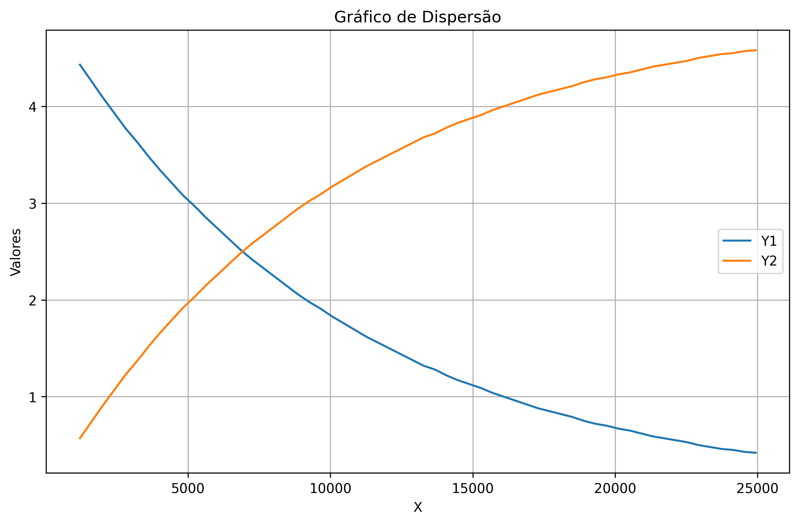

# Sensores e Atuadores Básicos

## Sobre este repositório

Este repositório contém a implementação de um circuito RC (resistor-capacitor) com leitura e visualização de dados.

---

## Arquivos

### `grafico.ipynb`
Notebook Jupyter que processa os dados obtidos do monitor serial do Arduino e gera gráficos mostrando o comportamento da tensão no resistor e no capacitor ao longo do tempo.

### Vídeos
- **Vídeo TinkerCad**: Demonstração do circuito RC simulado no TinkerCad com a saída do monitor serial
- **Vídeo Circuito Físico**: Demonstração do circuito RC físico mostrando o comportamento com switch aberto e fechado

---

## Gráfico Gerado



O gráfico mostra a evolução das tensões no resistor (Y1) e no capacitor (Y2) ao longo do tempo.

---

## Código Arduino Utilizado

```cpp
int pinoNoRC=0; 
int valorLido = 0;
float tensaoCapacitor = 0, tensaoResistor;
unsigned long time; 

void setup(){ 
  Serial.begin(9600); 
} 

void loop() { 
  time=millis(); 
  valorLido=analogRead(pinoNoRC); 
  tensaoResistor=(valorLido*5.0/1023); // 5.0V / 1023 degraus = 0.0048876 
  tensaoCapacitor = abs(5.0-tensaoResistor);
  Serial.print(time); //imprime o conteúdo de time no MONITOR SERIAL
  Serial.print(" "); 
  Serial.print(tensaoResistor);
  Serial.print(" ");
  Serial.println(tensaoCapacitor); 
  delay(400); 
}
```
